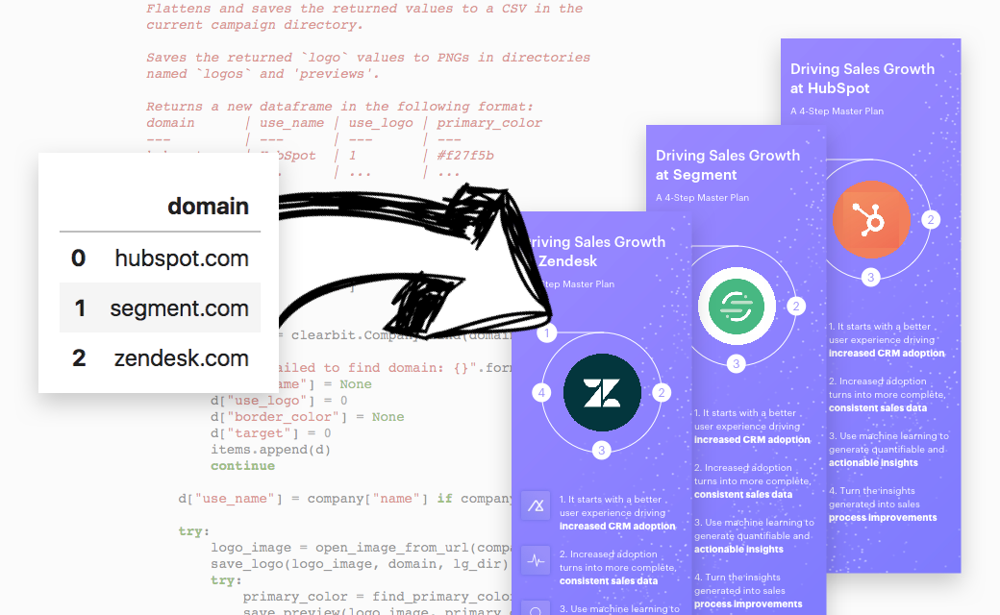

### SDRs put a lot of work into outbound messaging to capture the attention of prospects. What if they could... Not do that work?

A recent [Dogpatch Advisors](https://www.dogpatchadvisors.com/) [blog post](https://blog.dogpatchadvisors.com/how-to-automate-the-best-sales-prospecting-email-ever-aa6a8c9f532d) explained how their team had deconstructed the "best sales prospecting email ever" - taking a diagram some SDR at Engagio had painstakingly constructed and automating it to work on thousands of prospects across hundreds of companies.

Dogpatch, of course, productized their work and now offers a demo of Custom Images which you can find [here](https://www.dogpatchadvisors.com/product#custom-images).

That does seem like a good idea, but we're cheap. So let's do it ourselves.

[Read the notebook here](https://github.com/theianchan/base-image-scaler/blob/master/base-image-scaler.ipynb).
